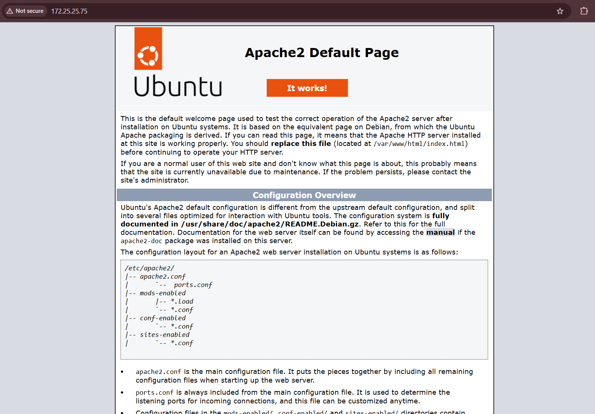
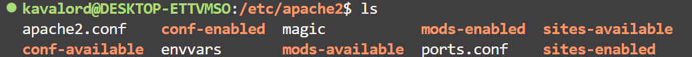
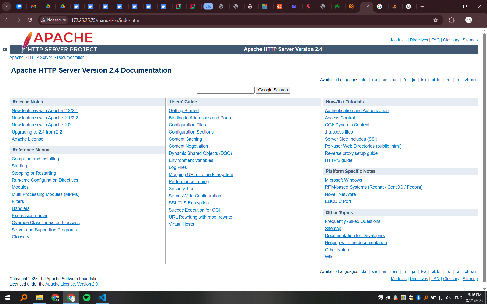
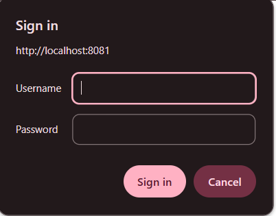
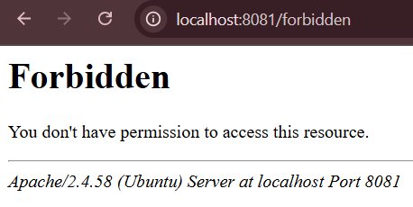

Установка через `sudo apt install apache2`
Сервер автоматически запускается на eth0 и при запросе на его ip отвечает дефолтной страничкой.

Запуск (ручной) подобной командой
`sudo service apache2 start`

Лежит в /etc/apache2



> By default, Ubuntu does not allow access through the web browser to any file outside of those located in /var/www, `public_html` directories (when enabled) and /usr/share (for web applications). If your site is using a web document root located elsewhere (such as in /srv) you may need to whitelist your document root directory in /etc/apache2/apache2.conf.

> The default Ubuntu document root is /var/www/html. You can make your own virtual hosts under /var/www.

Со внешних устройств доступа не будет - действует firewall Ubuntu. Ставят утилиту `ufw`.
`sudo apt install ufw`
`sudo ufw enable`
`sudo ufw allow http`
`sudo ufw allow 22/tcp`
`sudo ufw reload`

Получить статус
`sudo ufw status verbose`

С этого момента можно было бы получить доступ по HTTP с любого устройства, но мы на WSL, там свой виртуальный ip, не loopback, а по типу 172.25.25.75 :(



Утилита `apache2` - старая, а `apache2ctl` - новая

Логи в `/var/log/apache2$SUFFIX`, установлено в envvars

На Linux нету `./conf/httpd.conf` и manual доступен только если стоит `apache2-doc`
>Documentation for the web server itself can be found by accessing the manual if the apache2-doc package was installed on this server.

Просто поставить, не хватило, пришлось включить через
`sudo a2enconf apache2-doc`



Позже запихнем страницы в `/var/www` (в apache2.conf прописаны пути)

Скопируем дефолтный конфиг
`sudo cp sites-available/000-default.conf sites-available/webprog2.conf`

Получим конфиг

```
Listen 8081
Listen 8082

<VirtualHost *:8081>
    DocumentRoot "/var/www/webprog2/vh1"
    ServerName localhost
    <Directory "/var/www/webprog2/vh1">
    </Directory>
    <Directory "/var/www/webprog2/vh1/onlyAdmins">
    </Directory>
    <Directory "/var/www/webprog2/vh1/forbidden">
    </Directory>
    <Directory "/var/www/webprog2/vh1/onlySpecial">
    </Directory>
    ErrorLog "/var/www/webprog2/vhlogs/vh1-error.log"
    CustomLog "/var/www/webprog2/vhlogs/vh1-access.log" common
</VirtualHost>

<VirtualHost *:8082>
    DocumentRoot "/var/www/webprog2/vh2"
    ServerName localhost
    <Directory "/var/www/webprog2/vh2">
    </Directory>
    ErrorLog "/var/www/webprog2/vhlogs/vh2-error.log"
    CustomLog "/var/www/webprog2/vhlogs/vh2-access.log" common
</VirtualHost>
```

Получим ошибку
>Invalid command 'AuthGroupFile'

Потому что нужно подключить модуль `authz_groupfile` (для пользователей подключен по умолчанию).
`sudo a2enmod authz_groupfile`

В итоге получим запрос логина на страничках с правами доступа кроме полностью разрешенного:




Пароли пользователей добавляем в .htpasswd. Пароли можно(и нужно, иначе не заработает) шифровать:
`htpasswd -nb owner 123`
>owner:$apr1$pzDuKLBv$byvYJ82DT9tjsDE146QCD/

Индексация работает одинаково независимо от включения 
```
Options Indexes
IndexOptions FancyIndexing
```